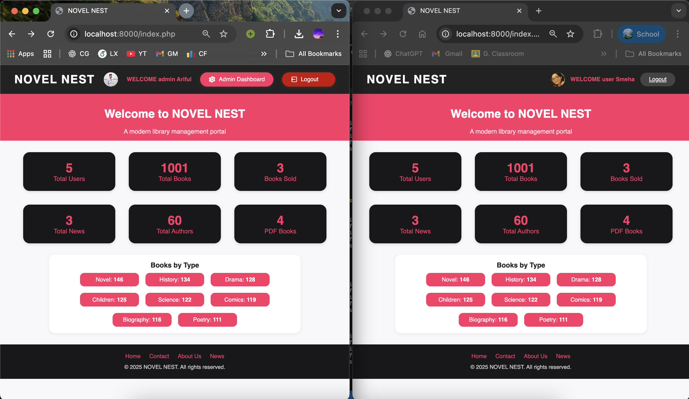
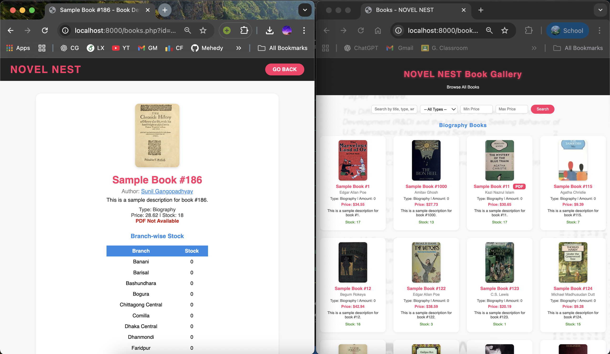
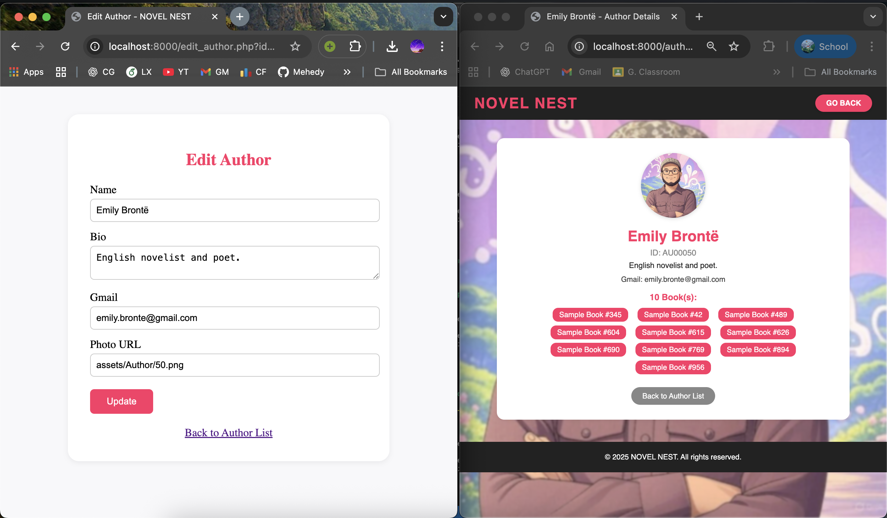
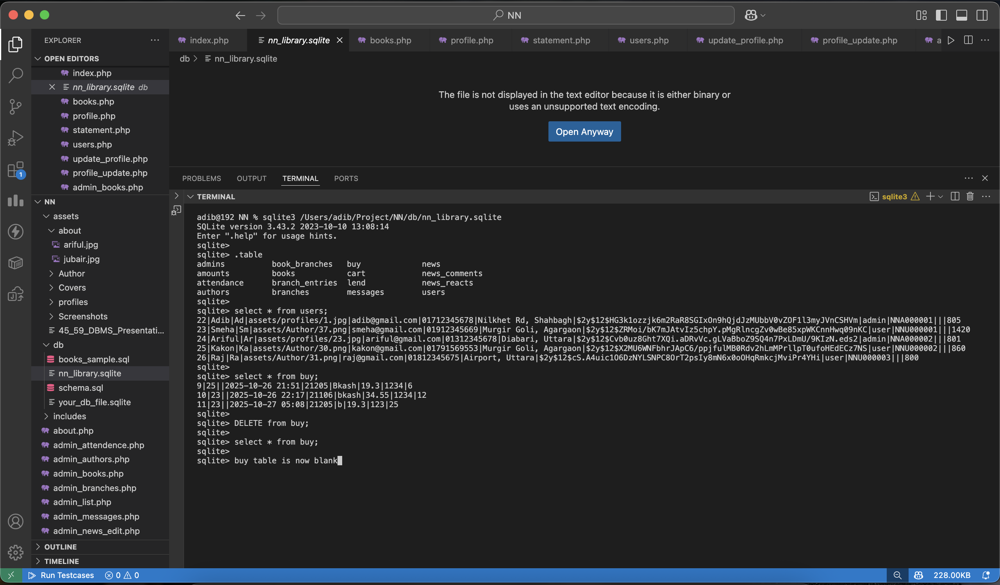
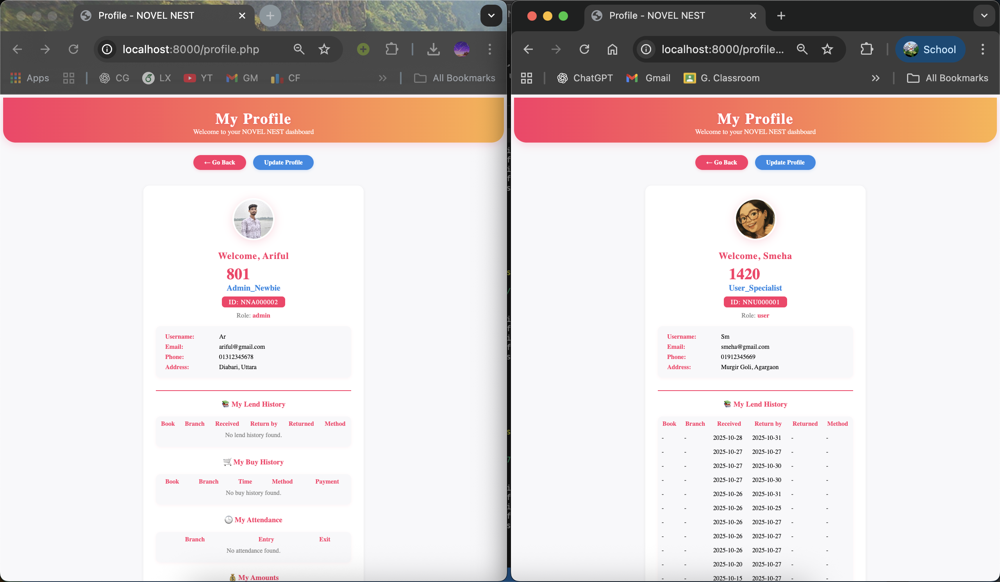

<div align="center">
  
</div>

# NOVEL NEST 📚

A comprehensive library management system connecting users, authors, and administrators. Features modern book management, lending, buying, attendance, news, messaging, and analytics.

## 📑 Table of Contents
<details open>
  <summary><b>Expand Table of Contents</b></summary>
  <ul>
    <li><a href="#-Screenshots">📷 Screenshots</a></li>
    <li><a href="#-project-overview">📚 Project Overview</a></li>
    <li><a href="#-features">✨ Features</a></li>
    <li><a href="#-prerequisites">📋 Prerequisites</a></li>
    <li><a href="#-installation--setup">🚀 Installation & Setup</a></li>
    <li><a href="#-project-architecture">🏗️ Project Architecture</a></li>
    <li><a href="#-usage">🧑‍💻 Usage</a></li>
    <li><a href="#-security-features">🛡️ Security Features</a></li>
    <li><a href="#-contributing">🤝 Contributing</a></li>
    <li><a href="#-contributors">👥 Contributors</a></li>
    <li><a href="#-license">📄 License</a></li>
    <li><a href="#-support--documentation">🆘 Support & Documentation</a></li>
  </ul>
</details>

---

## 📸 Screenshots
<div align="center">
  
  
  
  
  
  
</div>

## 📚 Project Overview

NOVEL NEST is a full-stack web application for library management:
- **Frontend**: PHP web pages, custom CSS, responsive design
- **Backend**: PHP with SQLite database
- **Database**: SQLite (default), easy to migrate to MySQL/PostgreSQL
- **Admin Panel**: Manage users, books, authors, branches, news, and more
- **User Portal**: Profile, lending, buying, attendance, messaging, news

## ✨ Features

### 👤 For Users
- Secure registration/login
- Browse/search books by type, author, price, PDF
- View author profiles and book lists
- Lend and buy books, view history, download receipts
- Attendance tracking (branch visits)
- Send messages to branch admins
- React and comment on news
- Personal profile management and rating system

### 🛠️ For Administrators
- Dashboard analytics and counters
- Manage users, books, authors, branches, news, sales
- View and reply to user messages
- Edit/delete news and books
- Attendance and lending management

### ⚙️ Technical Features
- Modern, responsive UI (custom CSS)
- SQLite database (easy migration)
- Secure session management
- File/image upload for covers and profiles
- Modular codebase for easy extension

## 📋 Prerequisites
- **PHP** 7.4+ (with SQLite PDO extension)
- **SQLite** (default, or MySQL/PostgreSQL for advanced use)
- **Web Server** (Apache, Nginx, XAMPP, MAMP, etc.)
- **Git** (for version control)

## 🚀 Installation & Setup

### 1. Clone the Repository
```bash
git clone https://github.com/your-username/novel-nest.git
cd Novel NEST - DBMS Project
```

### 2. Database Setup
- SQLite DB auto-generates on first run
- Schema: `db/schema.sql`
- Sample data: `db/books_sample.sql`

### 3. Configure PHP
- Place project in your web server root (e.g., `htdocs`)
- Ensure PHP SQLite extension is enabled

### 4. Assets
- All images, covers, and author photos in `assets/`

### 5. Run the App
- Open `index.php` in your browser
- Register as user or login as admin

## 🏗️ Project Architecture

```
├── about.php
├── admin.php
├── authors.php
├── books.php
├── contact.php
├── index.php
├── news.php
├── profile.php
├── users.php
├── ... (other modules)
├── assets/
│   ├── style.css
│   ├── logo.png
│   ├── Covers/
│   ├── Author/
│   ├── about/
│   └── ...
├── db/
│   ├── nn_library.sqlite
│   ├── schema.sql
│   └── books_sample.sql
├── includes/
│   └── db_connect.php
```

## 🧑‍💻 Usage
- **Users**: Register/login, update profile, lend/buy books, view history, send messages, react/comment on news
- **Admins**: Login, dashboard, manage users/books/authors/branches/news/messages
- **Contact/About**: Branch contact list, designer info

## 🛡️ Security Features
- Session-based authentication
- Password hashing
- Input validation
- File upload validation
- Role-based access control

## 🤝 Contributing
1. Fork the repository
2. Create a feature branch: `git checkout -b feature/your-feature`
3. Make your changes and commit: `git commit -m 'Add feature'`
4. Push to your branch: `git push origin feature/your-feature`
5. Open a Pull Request

## 👥 Contributors
<div align="center">

### 🚀 Project Team
<table>
  <tr>
    <td align="center">
      
      <br>
      <sub><b>Jubair Ahammad Akter</b></sub>
      <br>
      <a href="https://github.com/Jubair-Adib">💻 🎨 📱</a>
      <br>
      <small>Developer & Designer</small>
    </td>
    <td align="center">
      
      <br>
      <sub><b>Ariful Islam</b></sub>
      <br>
      <a href="https://github.com/arif-5223">💻 🗃️ ⚡</a>
      <br>
      <small>Developer & Specialist</small>
    </td>
  </tr>
</table>
</div>

## 📄 License
This project is for educational use. You may adapt and extend it for your own needs.

## 🆘 Support & Documentation
- 📧 Email: akteradib007@gmail.com
- 📖 See `about.php` for designer info
- 🐛 Issue Tracker: Use GitHub Issues
- 📄 Database schema: `db/schema.sql`
- 📊 Presentation: `assets/45_59_DBMS_Presentation.pptx`

---
<div align="center">

**Made with ❤️ for the library community**

*Connecting readers, writers, and admins for a smarter library experience*

[⬆ Back to Top](#novel-nest-) | [📑 Table of Contents](#-table-of-contents)

</div>
